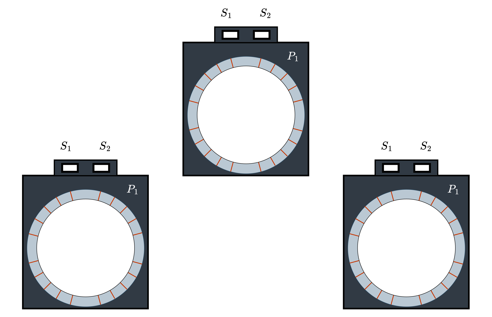
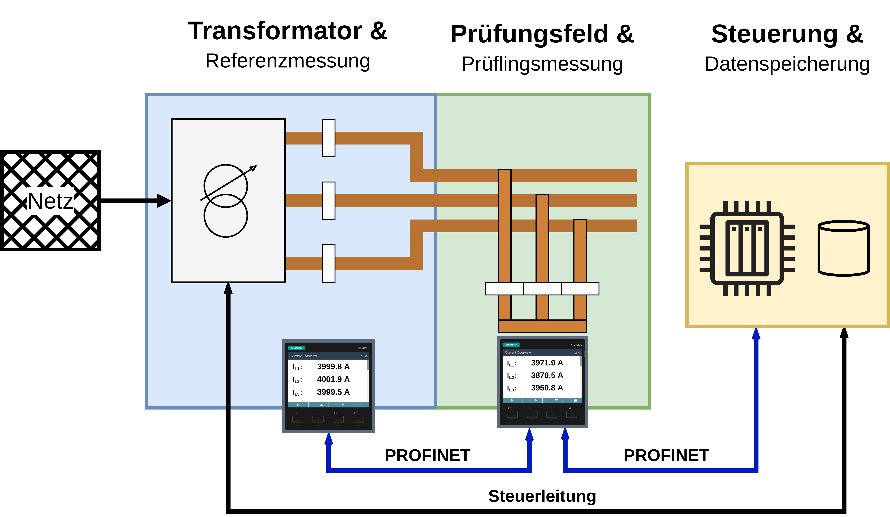

# Skript Kolloquium

## Fremdfeldbeeinflussung auf Messstromwandler in Niederspannungsschaltanlagen

Oliver-Luca Schmidt

---

## Folie 1 Titel

Moin zusammen und herzlich willkommen zu meinem Kolloquium.  
Mein Name ist Oliver Schmidt und ich stelle heute meine Bachelorarbeit vor, die ich bei der Rolf Janssen Elektrotechnische Werke GmbH erstellt habe.

Das Thema lautet **Fremdfeldbeeinflussung auf Messstromwandlern in Niederspannungsschaltanlagen**.

Im Mittelpunkt steht die Frage, wie magnetische Felder benachbarter Leiter die Strommessung verfälschen und welche Gegenmaßnahmen technisch und wirtschaftlich sinnvoll sind.

---

## Sprechertext (langsam zum Üben)

Moin zusammen.  
Schön, dass Sie heute da sind.

Ich bin **Oliver Schmidt**.  
Meine Bachelorarbeit habe ich bei der Firma **Rolf Janssen** in Aurich geschrieben.

In kompakten **Niederspannungsschaltanlagen** liegen **Sammelschienen** und **Messstromwandler** sehr dicht beieinander.  
Dadurch können sich **Magnetfelder** der Außenleiter überlagern.  
==Das führt in der Praxis zu systematischen **Messabweichungen**, besonders bei der mittleren Phase **L2**==.

Das ist relevant, weil **Strommesswerte** heute nicht nur für Punktuelle Überwachung genutzt werden.  
Sie werden auch für **Energiemonitoring** und teilweise für **Abrechnung** verwendet.

Gleichzeitig gibt es einen klaren Trend.

- Mehr **Leistungsdichte** auf weniger **Bauraum**.  
- Höhere Ströme bei kleineren **Leiterabständen**.  
- Und damit stärkere **Fremdfeldkopplung**.

==Ziel meiner Arbeit war es, Maßnahmen zu bewerten, die die Messung unter **Fremdfeldeinfluss** robuster machen==.  
Dabei habe ich verschiedene Ansätze verglichen, zum Beispiel **Wandlertechnologien**, **Schirmungsmaßnahmen** und die **Leitergeometrie**.

---

## Optionale Ergänzungen für die Titelfolie

Wenn auf der Folie noch Platz ist, können zwei kurze Zeilen ergänzt werden.

- **Leitfrage** Wie wird die Strommessung auf **L2** fremdfeldrobust bei vertretbaren Kosten  
- **Vergleich** **Standardwandler** vs **kompensiert** vs **Fremdfeldprotektion** und **Leitergeometrie**

---

## Folie 2 Agenda

### Text für die Folie

**Agenda**

1. Motivation und Problemstellung
2. Zielsetzung der Arbeit
3. Grundlagen Messstromwandler und Fehlermechanismus
4. Versuchsaufbau und Messmethodik
5. Ergebnisse und Empfehlung

---

### Sprechertext (langsam zum Üben)

==Ich gliedere den Vortrag in fünf Teile==.

- **Erstens**.  
  Ich zeige die Motivation und die Problemstellung.  
  Warum **Fremdfelder** in **Niederspannungsschaltanlagen** heute ein Problem sind.

- **Zweitens**.  
  Ich formuliere die Zielsetzung der Arbeit.  
  Also welche Fragen ich beantworten will und was am Ende bewertet werden soll.

- **Drittens**.  
  Ich gebe kurz die Grundlagen zum **Messstromwandler**.  
  So weit, dass klar wird, wie der Fehler durch **Fremdfeldkopplung** entsteht.

- **Viertens**.  
  Ich zeige den Versuchsaufbau am **Hochstrom-Prüfstand** und die **Messmethodik**.  
  Wie die Leiterschienen angeordnet waren, wie gemessen wurde und welche Größen ausgewertet wurden.

- **Fünftens**.  
  Ich zeige exemplarische Ergebnisse.  
  ==Daraus leite ich eine Empfehlung ab, einmal für neue Konstruktionen und einmal für Bestandsanlagen==.

---

## Folie 3 Motivation und Problemstellung

### Text für die Folie

Auf dem Bild sehen Sie eine typische Situation in einer kompakten Niederspannungsschaltanlage.  
Oben sitzen die Messstromwandler, darunter verlaufen die Sammelschienen dicht nebeneinander.

Drei Entwicklungen verstärken die Fremdfeldbeeinflussung

- höhere Leistungsdichte durch kompaktere Anlagen
- höhere Primärströme bei kleinen Leiterabständen
- stärkere magnetische Kopplung zwischen den Phasen

Wenn Messwerte für Energiemonitoring, Betriebsführung oder Abrechnung genutzt werden, sind systematische Abweichungen kein Detail mehr, sondern ein funktionales und wirtschaftliches Risiko.

---

### Sprechertext (langsam zum Üben)

Auf dem Bild sehen Sie eine typische Situation in einer kompakten **Niederspannungsschaltanlage**.  
Oben sind die **Messstromwandler** angeordnet.  
Darunter laufen die **Sammelschienen** sehr dicht nebeneinander.

In dieser Anordnung stecken drei Entwicklungen, die heute häufig zusammenkommen.

- **Erstens**.  
  Die Anlagen werden kompakter, weil Platz in Technikräumen knapp ist.  
  Dadurch steigt die **Leistungsdichte**.

- **Zweitens**.  
  Die **Primärströme** werden größer, aber die Abstände der Schienen bleiben oft klein.  
  Das liegt an **Bauraum** und **Kosten**.

- **Drittens**.  
  Wenn Leiter dicht beieinander liegen, steigt automatisch die **magnetische Kopplung** zwischen den Phasen.  
  Damit steigt auch die Wahrscheinlichkeit, dass **Fremdfelder** den **Messstromwandler** beeinflussen.

==Das ist nicht nur ein theoretisches Problem==.  
Sobald die Messwerte für **Energiemonitoring** oder **Betriebsführung** genutzt werden, ist eine Abweichung bereits kritisch.  
Und wenn Messwerte sogar in Richtung **Abrechnung** gehen, wird aus einem Messfehler ein echtes wirtschaftliches Risiko.

==Die zentrale Frage ist deshalb==.  
Wie groß ist dieser Einfluss in typischen Anordnungen.  
Und welche Maßnahmen reduzieren ihn zuverlässig.

---

## Folie 4 Messabweichung und wirtschaftliche Relevanz

### Text für die Folie

- **Typisches Muster**  
  L2 ist am stärksten betroffen, weil die Felder von L1 und L3 überlagern

- **Beispiel bei hoher Last**  
  Referenz  
  Abweichung praktisch 0  
  Prüfling  
  L2 zeigt deutlich zu wenig, ca. **-3 Prozent**

- **Wirtschaftliche Relevanz**  
  Bei Dauerlast und Nutzung für Kostenverteilung oder Abrechnung kann ein Messfehler spürbare Beträge verursachen  
  Beispielrechnung  
  Größenordnung **≈ 50.000 Euro pro Jahr**

---

### Bilder und Quellen

- Referenz  

---

### Sprechertext (langsam zum Üben)

==Ich möchte die Größenordnung früh klar machen==.

In meinen Messreihen zeigt sich ein Muster besonders häufig.  
Die mittlere Phase **L2** fällt am stärksten auf.  
Sie liegt zwischen **L1** und **L3** und wird von beiden Nachbarphasen magnetisch überlagert.  
==Damit befindet sie sich im ungünstigsten Feldbereich==.

Hier sehen Sie ein Beispiel bei hoher Last.  
Die **Referenzmessung** liegt praktisch bei null Abweichung.  
Der **Prüfling** zeigt in **L2** dagegen deutlich zu wenig.  
==In diesem Fall liegt die Abweichung bei ungefähr minus drei Prozent==.

Wenn man so einen Fehler über lange Zeit betrachtet, zum Beispiel bei **Dauerlast**, kann das wirtschaftlich relevant werden.  
Vor allem dann, wenn die Messwerte für **Kostenverteilung** oder **Abrechnung** genutzt werden.

==Die Beispielrechnung auf der Folie zeigt eine Größenordnung von ungefähr fünfzigtausend Euro pro Jahr==.  
Das ist eine Beispielzahl, aber sie macht klar, warum sich eine konstruktiv saubere Lösung lohnen kann.

---

## Folie 5 Zielsetzung der Arbeit

### Text für die Folie

**Leitfrage**  
Wie wird die Strommessung im kompakten Drehstromsystem, Worst Case L2, **fremdfeldrobust** bei vertretbaren Kosten und Bauraum

**Ziele der Arbeit**

1. **Analyse**  
   Fehlermechanismen und Einflussgrößen im Drehstromsystem

2. **Vergleich**  
   Standardwandler vs kompensierte Wandler vs Lösungen mit Fremdfeldprotektion und Geometrien

3. **Empfehlung**  
   Entscheidungsgrundlage für Neukonstruktion und realistische Maßnahmen für Bestandsanlagen

**Bewertungskriterien**  
Normkonformität, Fremdfeldrobustheit, Bauraum, Kosten, Verfügbarkeit

---

### Sprechertext (langsam zum Üben)

Auf Basis der Motivation ergeben sich drei konkrete Ziele.

- **Erstens**.  
  Ich analysiere die Fehler im **Drehstromsystem** systematisch.  
  Ich betrachte alle drei Phasen unter gleichen Bedingungen und vergleiche die Abweichungen direkt.  
  ==So wird sichtbar, welche Phase besonders kritisch ist und welche Einflussgrößen dominieren==.

- **Zweitens**.  
  Ich vergleiche verschiedene technische Lösungsansätze.  
  Im Fokus stehen **Standardwandler**, **kompensierte Wandler** und eine Lösung mit **Fremdfeldprotektion**.  
  Zusätzlich spielt die **Leitergeometrie** eine Rolle, weil sie die Feldverteilung direkt beeinflusst.

- **Drittens**.  
  Ich leite daraus eine Handlungsempfehlung ab.  
  Die Empfehlung soll für eine Neukonstruktion praktikabel sein.  
  ==Und sie soll gleichzeitig zeigen, was im Bestand realistisch nachrüstbar ist==.

Bewertet habe ich die Lösungen anhand von fünf Kriterien.  
**Normkonformität**, **Fremdfeldrobustheit**, **Bauraum**, **Kosten** und **Verfügbarkeit**.

---

## Folie 6 Funktionsprinzip und Aufbau

### Text für die Folie

**Aufgaben des Messstromwandlers**

- Transformation hoher Primärströme auf 1 A oder 5 A  
- Galvanische Trennung zwischen Leistungspfad und Messkette  
- Bündelung des magnetischen Flusses im Eisenkern für eine proportionale Messung  

**Kernaussage für den Fehlermechanismus**

- Der Kern sieht nicht nur den Nutzfluss des eigenen Primärleiters  
- Benachbarte Leiter koppeln Störfluss ein  
- Nutzfluss und Störfluss überlagern sich lokal  
- Frühe Teilsättigung führt zu kleinerem Sekundärstrom, Anzeige zeigt zu wenig  

---

### Sprechertext (langsam zum Üben)

Als Grundlage brauche ich kurz das Funktionsprinzip.

Ein **Messstromwandler** ist im Kern ein Stromtransformator.  
Er transformiert hohe Primärströme auf einen standardisierten Sekundärstrom, typischerweise 1 Ampere oder 5 Ampere.  
Zusätzlich trennt er galvanisch, also der Leistungsteil ist elektrisch von der Messkette getrennt.  
Und er bündelt den magnetischen Fluss im **Eisenkern**, damit der Sekundärstrom proportional zum Primärstrom bleibt.

Der kritische Punkt ist die magnetische Aussteuerung des Kerns.  
Der Kern sieht nicht nur den **Nutzfluss**, der durch den eigenen Primärleiter entsteht.  
Wenn benachbarte Leiter nahe genug sind, koppelt **Störfluss** ein.

Nutzfluss und Störfluss überlagern sich lokal im Kern.  
==Dadurch kann ein Teil des Kerns früher in **Sättigung** geraten==.

Sobald **Sättigung** einsetzt, steigt der **Magnetisierungsanteil**.  
Dann leidet die Proportionalität.  
Und der Sekundärstrom wird kleiner als ideal.

==Praktisch bedeutet das. Die Anzeige zeigt zu wenig an==.

---

## Folie 7 Technologievergleich

  

  

  

### Text für die Folie

**Drei Hebel zur Reduktion der Fremdfeldbeeinflussung**

1. **Kompensierter Wandler**  
   Wandlerdesign unterdrückt äußere Magnetfelder, sehr stabil über den Lastbereich  
   Nachteile: höhere Kosten, geringere Varianten und Beschaffungsflexibilität

2. **FFP, Fremdfeldprotektion**  
   zusätzlicher magnetischer Weg lenkt Störfluss um oder schwächt ihn ab  
   geeignet für Bestandsanlagen, weil die Leiterführung nicht zwingend neu aufgebaut werden muss  
   Nachteile: Bauraum, Montage und Ausrichtung beeinflussen die Wirkung

3. **Geometrie, Dreieck mit Standardwandler**  
   Standardwandler bleibt, aber Leiterführung wird so geändert, dass die Feldüberlagerung bei L2 sinkt  
   Vorteile: systemischer Effekt, oft wirtschaftlich  
   Hinweis: abhängig von Einbauraum und konstruktiven Randbedingungen

---

### Sprechertext (langsam zum Üben)

==Ich habe drei Hebel verglichen, die auf unterschiedlichen Ebenen ansetzen==.

- **Erster Hebel**.  
  Der **kompensierte Wandler**.  
  Hier wird das Wandlerdesign so ausgelegt, dass äußere Magnetfelder besser unterdrückt werden.  
  Das ist technisch sehr stark und bleibt über den Lastbereich meist sehr stabil.  
  Der typische Nachteil ist der deutlich höhere Preis.  
  Und oft gibt es weniger Flexibilität bei Varianten und Beschaffung.

- **Zweiter Hebel**.  
  Die **Fremdfeldprotektion**, kurz **FFP**.  
  Dabei wird ein zusätzlicher magnetischer Weg bereitgestellt, der Störfluss abschwächt oder umlenkt.  
  ==Das ist besonders interessant für Bestandsanlagen, weil man nicht zwingend die komplette Leiterführung neu bauen muss==.  
  Der Nachteil liegt häufig im zusätzlichen Bauraum und in der Montageabhängigkeit.  
  Wenn die Ausrichtung nicht reproduzierbar ist, kann die Wirkung streuen.

- **Dritter Hebel**.  
  Die **Geometrie**.  
  Hier bleibt der Wandler ein **Standardwandler**, aber die Leiter werden nicht parallel geführt, sondern in einer **Dreiecksanordnung**.  
  Dadurch verändert sich die Feldüberlagerung im Bereich der mittleren Phase **L2**.  
  ==Und die kritische Einkopplung kann deutlich sinken==.  
  Das ist attraktiv, weil die Lösung systemisch wirkt und oft wirtschaftlich ist.

---

## Folie 8 Physikalisches Problem Fremdfeldeinfluss

### Text für die Folie

**Ursache: Räumliche Nähe**

- Starke Magnetfelder der Nachbarleiter koppeln in den Wandlerbereich ein  
- Worst Case im Drehstromsystem häufig **L2**, weil Überlagerung von beiden Seiten

**Wirkung: Partielle Sättigung**

- Nutzfluss plus Störfluss erhöhen lokal die Aussteuerung  
- Effektive Permeabilität sinkt, Magnetisierungsanteil steigt  
- Proportionalität zwischen Primär und Sekundär verschlechtert sich

**Resultat**

- Sekundärstrom sinkt  
- Messung zeigt zu wenig an, typischerweise als Untererfassung in L2

---

### Sprechertext (langsam zum Üben)

Diese Folie zeigt den Mechanismus in einem Bild.

Die Ursache ist räumliche Nähe.  
Die Magnetfelder der Nachbarleiter koppeln in den Bereich des **Messstromwandlers** ein.  
==Im Drehstromsystem ist die mittlere Phase **L2** häufig der Worst Case==,  
weil sie zwischen den beiden anderen Phasen liegt und damit von beiden Seiten überlagert wird.

Die Wirkung ist eine partielle Sättigung im **Eisenkern**.  
Der Kern sieht nicht nur den Nutzfluss des eigenen Primärleiters.  
Zusätzlich kommt **Störfluss** dazu.  
Nutzfluss und Störfluss addieren sich lokal,  
dadurch steigt die Aussteuerung in einem Kernbereich überproportional.

Wenn das passiert, sinkt die effektive **Permeabilität**.  
Der **Magnetisierungsanteil** steigt  
und die Messkette verliert Proportionalität.

==Das Ergebnis ist eindeutig. Der Sekundärstrom wird kleiner als ideal==.  
Damit zeigt die Messung zu wenig an.  
Genau deshalb tritt der Fehler in der Praxis häufig als Untererfassung in **L2** auf.

---

## Folie 9 Versuchsaufbau Hochstrom Prüfstand

### Text für die Folie

**Prinzip: direkte Vergleichsmessung**

- gleicher Primärstrompfad  
- **Referenzmessung** parallel zur **Prüflingsmessung**  
- Abweichung wird direkt aus beiden Messwerten bestimmt, ohne indirekte Annahmen

**Messprogramm**

- definierte Stromstufen, typischer Bereich **2000 bis 4000 A**  
- reproduzierbares Anfahren der Lastpunkte für vergleichbare Kennlinien  
- Auswertung phasenweise, um Unterschiede zwischen L1, L2 und L3 sichtbar zu machen

---

### Sprechertext (langsam zum Üben)

Ich komme zur Methodik.

Die Messungen habe ich an einem **Hochstrom-Prüfstand** durchgeführt.  
Wichtig ist dabei das Prinzip der direkten Vergleichsmessung.

Der gleiche Primärstrom läuft durch eine definierte Leiteranordnung.  
Diesen Strom erfasse ich parallel auf zwei Wegen.

- Einmal über die **Referenzmessung**.  
- Und gleichzeitig über die **Prüflingsmessung**, also **Messstromwandler** plus Messgerät.

==Damit kann ich die Abweichung direkt bestimmen==.  
Ich brauche keine indirekten Annahmen und keine Umrechnung über externe Modelle.  
Der Vergleich passiert im gleichen Strompfad und zum gleichen Zeitpunkt.

Die Messreihen laufen über definierte Stromstufen, typischerweise im Bereich von 2000 bis 4000 Ampere.  
Die Lastpunkte werden reproduzierbar angefahren, damit Kennlinien wirklich vergleichbar sind.

So kann ich erkennen, ab wann Nichtlinearitäten auftreten.  
==Und ich kann auswerten, ob sich diese Effekte phasenabhängig zeigen, also ob **L2** systematisch stärker abweicht als **L1** und **L3**==.

---

## Folie 10 Exemplarisches Messergebnis FFP

### Text für die Folie

- **FFP reduziert die Abweichungen** im relevanten Lastbereich deutlich  
- **L2 bleibt am empfindlichsten**, weil sie im Feldzentrum liegt  
- Für den **Bestand** attraktiv, da ohne komplette neue Leiterführung umsetzbar  
- Wichtig in der Praxis  
  Positionierung und Montage müssen reproduzierbar sein, sonst streut die Wirkung

### Sprechertext (langsam zum Üben)

Hier zeige ich ein Beispiel für die **Fremdfeldprotektion**.

==Man sieht, dass sich die Abweichungen im relevanten Bereich deutlich reduzieren lassen==.  
Gleichzeitig bleibt **L2** der empfindlichste Kanal.  
Das passt zur physikalischen Erklärung, weil **L2** im Feldzentrum liegt und von beiden Nachbarphasen überlagert wird.

Für Bestandsanlagen ist dieser Ansatz interessant.  
==Man kann eine deutliche Verbesserung erreichen, ohne die komplette Leiterführung neu aufzubauen==.

In der Praxis ist aber entscheidend, dass die Protektion korrekt positioniert ist.  
Und dass die Montage reproduzierbar ist.  
Sonst kann die Wirkung von Anlage zu Anlage schwanken.

---

## Folie 11 Standard im Dreieck gegen kompensiert

### Text für die Folie

- **Kompensierter Wandler**  
  sehr nah an idealer Übersetzung, robust über großen Lastbereich  
  geeignet bei maximaler Genauigkeit und breitem Betriebsbereich  
  Nachteil: höhere Kosten, oft weniger Varianten

- **Standardwandler in Dreieck-Geometrie**  
  Messgüte wird über Leitergeometrie stabilisiert  
  Standardkomponenten bleiben nutzbar, wirtschaftlich für Neukonstruktion  
  systemischer Effekt, reduziert die kritische L2 Einkopplung

### Sprechertext (langsam zum Üben)

==Jetzt kommt der Kernvergleich, weil er direkt zur Empfehlung führt==.

- **Kompensierte Variante**.  
  Die kompensierte Variante bleibt über einen großen Bereich sehr nahe an der idealen Übersetzung.  
  Sie ist technisch robust, auch wenn die Last steigt oder die Umgebung magnetisch ungünstig ist.  
  ==Diese Lösung ist besonders geeignet, wenn maximale Genauigkeit gefordert ist oder wenn ein breiter Betriebsbereich abgesichert werden muss==.

- **Dreiecksanordnung mit Standardwandlern**.  
  Die Dreiecksanordnung mit Standardwandlern zeigt aber ebenfalls einen starken Effekt.  
  Der entscheidende Vorteil ist, dass die Messgüte über Geometrie stabilisiert wird, ohne den Wandler selbst zum Spezialteil zu machen.  
  ==Das ist für eine Neukonstruktion attraktiv, weil es Kosten und Risiko senkt und gleichzeitig die Messung verbessert==.

---

## Folie 12 Bewertung der Lösungsansätze

### Text für die Folie

**Entscheidung nach Einsatzfall**

- **Maximale Genauigkeit**  
  kompensierte Wandler  
  beste Kennlinien, aber höhere Kosten

- **Bestand, Nachrüstung**  
  FFP  
  starke Verbesserung ohne komplette neue Leiterführung  
  Montage muss robust und reproduzierbar sein

- **Neukonstruktion, Wirtschaftlichkeit**  
  Standardwandler plus Dreieck  
  sehr guter Kompromiss aus Messgüte und Kosten  
  Standardkomponenten bleiben nutzbar, besonders gut im Nennlastbereich

**Gemeinsamkeit**  
Alle Ansätze reduzieren die L2 Verzerrung  
Unterschiede liegen in Kosten, Bauraum und Integrationsaufwand

### Sprechertext (langsam zum Üben)

==Ich fasse die Bewertung als Entscheidung nach Einsatzfall zusammen==.

- Wenn höchste Genauigkeit im Vordergrund steht, sind **kompensierte Wandler** die technisch beste Wahl.  
  Sie liefern die stabilsten Kennlinien.  
  Der Nachteil ist der Preis, der in der Praxis oft deutlich höher liegt als bei Standardwandlern.

- Wenn eine Nachrüstung im Bestand gefragt ist, ist **FFP** häufig die pragmatischste Lösung.  
  Sie kann starke Verbesserungen bringen, ohne dass die gesamte Leiterführung neu konstruiert werden muss.  
  ==Wichtig ist dabei eine robuste Montage, damit die Wirkung konstant bleibt==.

- Wenn es um neue Felder geht, ist die **Dreiecksanordnung mit Standardwandlern** der Preis Leistungs Sieger.  
  Die Messgüte wird über eine systemische Maßnahme erreicht.  
  Dadurch bleiben Standardkomponenten nutzbar und die Konstruktion kann trotzdem normnah messen, besonders im Nennlastbereich.

Der gemeinsame Nenner ist.  
==Alle drei Ansätze reduzieren die **L2** Verzerrung==.  
Die Unterschiede liegen vor allem in **Kosten**, **Bauraum** und **Integrationsaufwand**.

---

## Folie 13 Customer Win Standardwandler plus Dreieck

  
  

### Text für die Folie

- **Standardwandler bleiben Standard**  
  keine Spezialteile, weniger Beschaffungsrisiko

- **Kostenwirkung**  
  Einsparpotenzial in der Größenordnung von **≈ 1000 Euro pro dreiphasigem Feld**  
  je nach Ausführung und Stückzahlen

- **Messgüte im Nennbereich**  
  deutliche Verbesserung trotz Fremdfeld  
  besonders relevant bei typischer Betriebszeit um **80 bis 100 Prozent Last**

- **Nutzen für Serie**  
  senkt Kosten und verbessert Messqualität gleichzeitig

### Sprechertext (langsam zum Üben)

Diese Folie übersetzt die technische Empfehlung in Nutzenargumente.

Wenn Standardwandler beibehalten werden können und die Leiterführung in **Dreieck** ausgeführt wird, gibt es zwei Effekte.

- **Erstens**.  
  ==Erstens sinken die Stückkosten==.  
  Man benötigt keine Spezialwandler.  
  In der Folie ist dafür eine Größenordnung von rund **1000 Euro pro dreiphasigem Feld** angegeben.

- **Zweitens**.  
  ==Zweitens verbessert sich die Messgüte im Nennbereich deutlich, obwohl Fremdfelder vorhanden sind==.  
  Das ist relevant, weil viele Anlagen den Großteil ihrer Betriebszeit genau in diesem Bereich verbringen, grob zwischen **80 und 100 Prozent Last**.

Damit wird die Lösung interessant für Serienkonstruktionen.  
==Sie senkt Kosten und verbessert die Messqualität gleichzeitig==.

---

## Folie 14 Abschluss

### Text für die Folie

1. Magnetische Fremdfelder in kompakten Niederspannungsschaltanlagen erzeugen systematische Messfehler, besonders in L2  
2. Kompensierte Wandler beherrschen den Effekt technisch sehr gut, aber mit höheren Kosten  
3. FFP ist eine starke Option für Bestandsanlagen, wenn Bauraum und Montage reproduzierbar sind  
4. Standardwandler plus Dreieck ist die bevorzugte Empfehlung für Neukonstruktionen, wegen gutem Kompromiss aus Messgüte und Wirtschaftlichkeit  

Vielen Dank für Ihre Aufmerksamkeit.  
Ich stehe jetzt gern für Fragen zur Verfügung.

### Sprechertext (langsam zum Üben)

==Ich fasse die Kernaussagen in vier Sätzen zusammen==.

- **Erstens**.  
  Magnetische **Fremdfelder** in kompakten **Niederspannungsschaltanlagen** können zu systematischen Messfehlern führen, besonders in **L2**.

- **Zweitens**.  
  Der Effekt lässt sich durch **kompensierte Wandler** technisch sehr gut beherrschen, allerdings zu höheren Kosten.

- **Drittens**.  
  **FFP** ist eine starke Option für Bestandsanlagen, wenn Bauraum vorhanden ist und die Montage reproduzierbar umgesetzt werden kann.

- **Viertens**.  
  ==Die Dreiecksanordnung mit Standardwandlern ist die bevorzugte Empfehlung für neue Konstruktionen, weil sie einen sehr guten Kompromiss aus Messgüte und Wirtschaftlichkeit bietet==.

Vielen Dank für Ihre Aufmerksamkeit.  
Ich stehe jetzt gern für Fragen zur Verfügung.

# Anhang für die Fragerunde

## Überblick über mehrere Stromniveaus

## Kennlinien für einzelne Stromstufen

  
  
  
