# Skript Kolloquium

## Fremdfeldbeeinflussung auf Messstromwandler in Niederspannungsschaltanlagen

Oliver-Luca Schmidt

---

## Folie 1 Titel

Moin Zusammen,

Herzlich willkommen zur Präsentation meiner Bachelorarbeit. Mein Name ist Oliver Schmidt, ich habe die Bachelorarbeit in der Firma Rolf Janssen geschrieben. Thema der Arbeit war die Anlyse der Fremdfeldbeeinflussung auf Messstromwandlern in Niederspannungsschaltanlagen.

Die Arbeit umfasst einmal was ist die Fremdfeldbeeinflussung ist  und welche Maßnahmen können die Beeinflussung 

---

## Folie 2 Agenda

Ich gliedere den Vortrag in fünf Teile.

Zuerst zeige ich Motivation und Problemstellung. Danach formuliere ich die Zielsetzung der Arbeit. Anschließend fasse ich das Funktionsprinzip eines Messstromwandlers so zusammen, dass der Fehlermechanismus klar wird. Danach kommt der Versuchsaufbau am Hochstrom Prüfstand und die Messmethodik. Zum Schluss zeige ich exemplarische Ergebnisse und leite daraus eine Empfehlung für neue Konstruktionen und für Bestandsanlagen ab.

---

## Folie 3 Motivation und Problemstellung

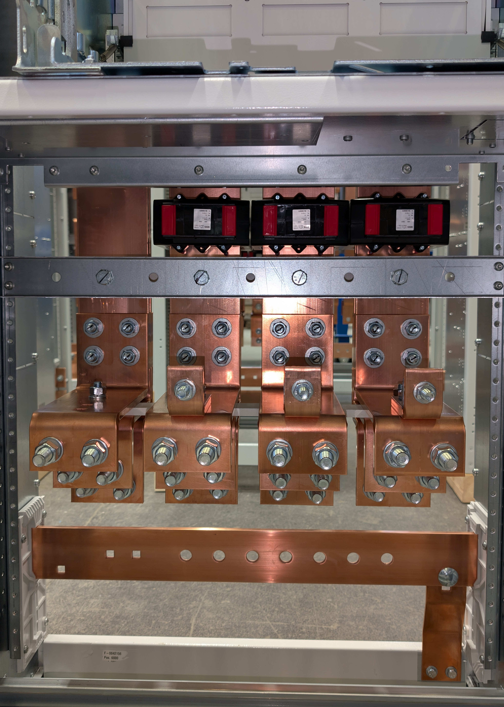

Auf dem Bild sehen Sie eine typische Situation in einer kompakten Niederspannungsschaltanlage. Oben sitzen die Messstromwandler, darunter laufen die Sammelschienen dicht nebeneinander.

Hier stecken drei Entwicklungen drin. Erstens steigt die Leistungsdichte, weil Anlagen kompakter werden. Zweitens steigen die Primärströme, während die Schienenabstände oft klein bleiben. Drittens bedeutet das automatisch stärkere magnetische Kopplung zwischen den Phasen.

Das Problem daran ist nicht theoretisch. Wenn Messwerte für Energiemonitoring, Betriebsführung oder sogar Abrechnung genutzt werden, dann sind systematische Abweichungen nicht mehr nur eine Schönheitsfrage. Dann wird aus einem Messfehler ein funktionales und wirtschaftliches Risiko.

---

## Folie 4 Messabweichung und wirtschaftliche Relevanz

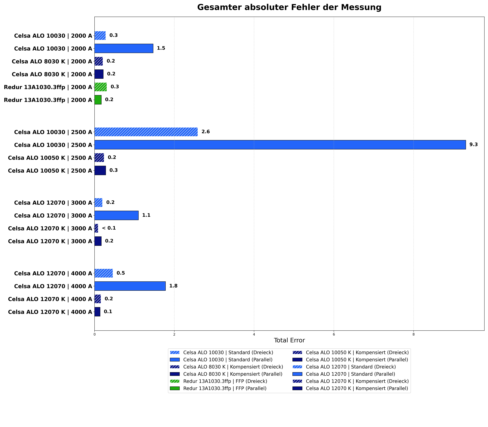

Ich möchte die Größenordnung früh klar machen. In meinen Messreihen zeigt sich besonders häufig ein Muster. Die mittlere Phase L2 fällt am stärksten auf. Sie wird von beiden Nachbarphasen überlagert und ist damit im ungünstigsten Feldbereich.

In einem Beispiel bei hoher Last liegt die Abweichung der Referenzmessung praktisch nahe bei null, während der Prüfling in L2 deutlich zu wenig anzeigt. In den Unterlagen ist dieser Fall im Bereich von rund minus drei Prozent dargestellt.

Wenn man so einen Fehler über lange Zeit in einer Dauerlast betrachtet und die Messwerte für Abrechnung oder Kostenverteilung heranzieht, kann daraus ein großer Betrag entstehen. Die Folie mit der Beispielrechnung zeigt eine Größenordnung von ungefähr fünfzigtausend Euro pro Jahr. Das ist eine Beispielzahl, aber sie macht klar, dass es sich lohnen kann, den Effekt konstruktiv sauber zu lösen.

Optional zum Nachschlagen liegen die Anzeigen auch als PDFs im Projekt.

- Referenz  
  `03_Ressourcen/pac/PAC_Anzeige-4000A-Parallel-100p-Referenz.pdf`

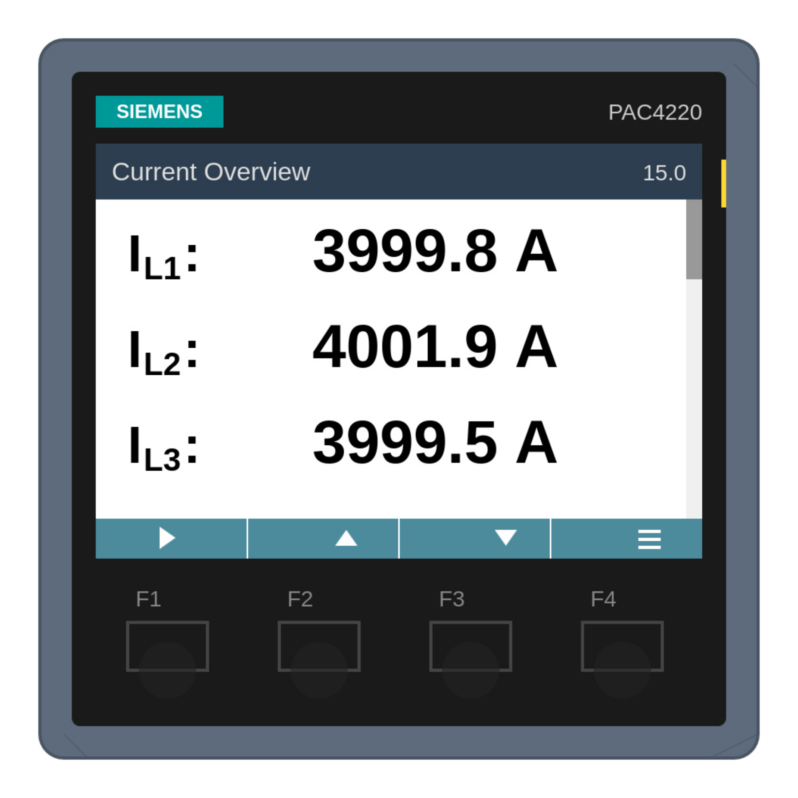- Prüfling  
  `03_Ressourcen/pac/PAC_Anzeige-4000A-Parallel-100p-Pruefling.pdf`

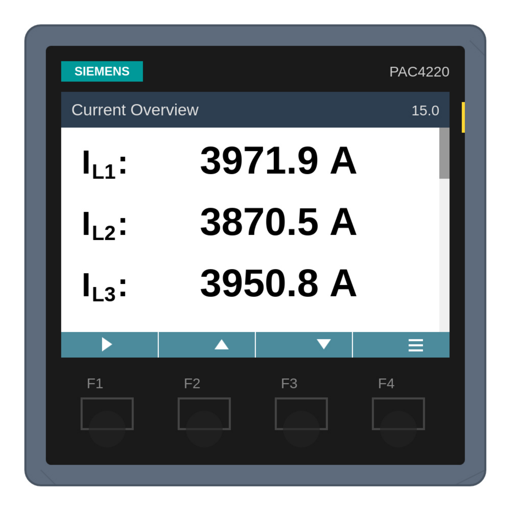
---

## Folie 5 Zielsetzung der Arbeit

Auf Basis dieser Motivation ergeben sich drei konkrete Ziele.

Ich habe erstens die Fehler im Drehstromsystem systematisch analysiert. Das heißt, ich betrachte alle drei Phasen unter gleichen Bedingungen und vergleiche die Abweichungen, statt nur einen Leiter einzeln zu bewerten.

Ich habe zweitens verschiedene technische Lösungsansätze verglichen. Im Fokus stehen Standardwandler, kompensierte Wandler und eine Lösung mit Fremdfeldprotektion.

Ich habe drittens eine Handlungsempfehlung abgeleitet. Diese Empfehlung soll für eine Neukonstruktion praktikabel sein und soll gleichzeitig zeigen, was im Bestand realistisch nachrüstbar ist.

---

## Folie 6 Funktionsprinzip und Aufbau

Als Grundlage brauche ich kurz das Funktionsprinzip.

Ein Messstromwandler ist im Kern ein Stromtransformator. Er hat die Aufgabe, hohe Primärströme auf einen standardisierten Sekundärstrom zu transformieren, typischerweise 1 Ampere oder 5 Ampere. Zusätzlich sorgt er für galvanische Trennung zwischen Leistungsteil und Messkette. Und er bündelt den magnetischen Fluss im Eisenkern, damit die Messung proportional bleibt.

Der kritische Punkt ist die magnetische Aussteuerung des Kerns. Der Kern sieht nicht nur den Nutzfluss des eigenen Primärleiters. Wenn benachbarte Leiter nahe genug sind, koppelt Störfluss ein. Nutzfluss und Störfluss addieren sich lokal. Dadurch kann ein Teil des Kerns früher in Sättigung geraten.

Wenn Sättigung einsetzt, steigt der Magnetisierungsanteil, die Proportionalität leidet und der Sekundärstrom wird kleiner, als er ideal wäre. Praktisch heißt das, die Anzeige zeigt zu wenig an.

Für die Foliengrafik findest du die zugehörigen Zeichnungen im Projekt.

- Prinzip Wandler  
  `03_Ressourcen/zeichnungen/aufbau_wandler.drawio.pdf`

---

## Folie 7 Technologievergleich

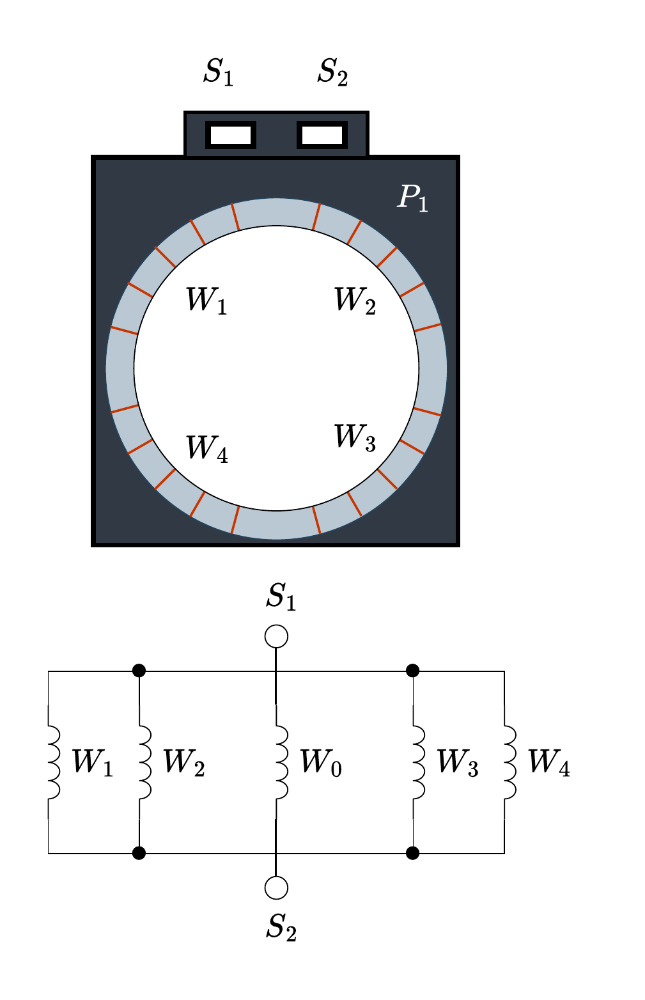

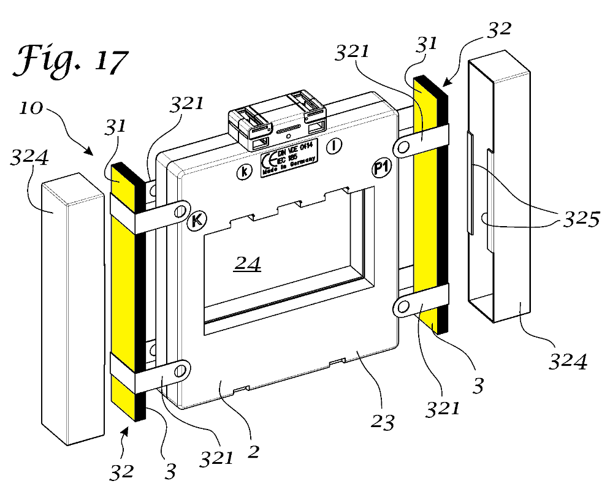

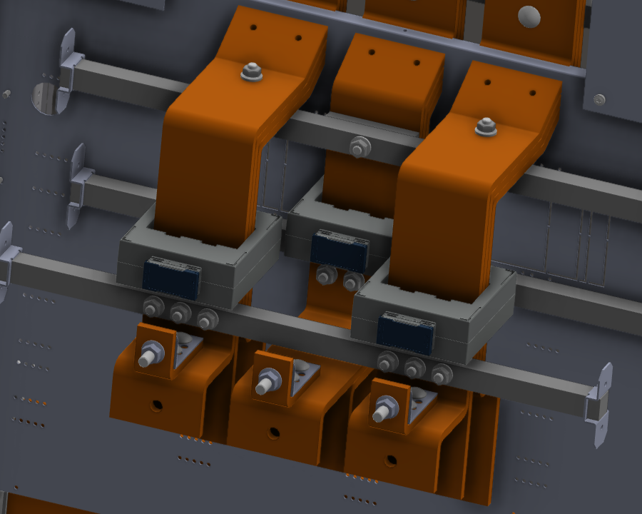

Ich habe drei Hebel verglichen, die auf unterschiedlichen Ebenen ansetzen.

Der erste Hebel ist der kompensierte Wandler. Hier wird das Wandlerdesign so ausgelegt, dass äußere Einflüsse besser unterdrückt werden. Das ist technisch sehr stark und besonders stabil über den Lastbereich. Der Nachteil ist meist der deutlich höhere Preis und die geringere Flexibilität bei Beschaffung und Variantenvielfalt.

Der zweite Hebel ist die Fremdfeldprotektion, oft als FFP bezeichnet. Dabei wird ein zusätzlicher magnetischer Weg bereitgestellt, der Störfluss abschwächt oder umlenkt. Das ist besonders interessant für Bestandsanlagen, weil man nicht zwingend die komplette Leiterführung neu bauen muss. Der Nachteil liegt häufig in Bauraum und Montageabhängigkeit. Wenn die Ausrichtung nicht sauber reproduziert wird, kann die Wirkung streuen.

Der dritte Hebel ist die Geometrie. Hier bleibt der Wandler ein Standardwandler, aber die Leiter werden nicht parallel geführt, sondern in einer Dreiecksanordnung. Dadurch verändert sich die Feldüberlagerung im Bereich der mittleren Phase, und die kritische Einkopplung kann deutlich sinken. Das ist attraktiv, weil die Lösung systemisch wirkt und oft wirtschaftlich ist.

Zu den Varianten gibt es passende Zeichnungen.

- Aufbau kompensiert  
  `03_Ressourcen/zeichnungen/aufbau_wandler_kompensiert.drawio.png`
- Aufbau mit FFP  
  `03_Ressourcen/zeichnungen/aufbau_wandler_FFP.drawio.pdf`

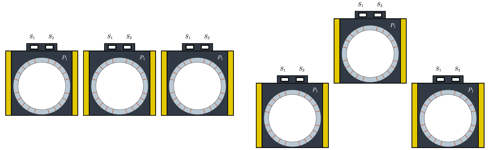 

## Folie 8 Physikalisches Problem Fremdfeldeinfluss

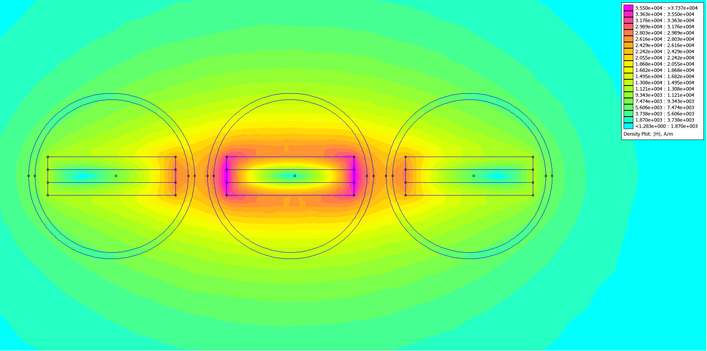

Diese Folie zeigt den Mechanismus in einem Bild.

Die Ursache ist räumliche Nähe. Die Magnetfelder der Nachbarleiter koppeln in den Bereich des Wandlers ein. Im Drehstromsystem ist L2 oft am stärksten betroffen, weil L2 zwischen den beiden anderen Phasen liegt und dadurch von beiden Seiten überlagert wird.

Die Wirkung ist eine partielle Sättigung. Nutzfluss plus Störfluss führen lokal zu höherer Aussteuerung. Wenn die effektive Permeabilität sinkt, steigt der Magnetisierungsanteil und die Messkette verliert Genauigkeit.

Das Ergebnis ist klar. Der Sekundärstrom sinkt und die Anzeige erfasst zu wenig. Genau deshalb taucht der Fehler häufig als Untererfassung in L2 auf.

---

## Folie 9 Versuchsaufbau Hochstrom Prüfstand

Ich komme zur Methodik.

Ich habe die Messungen an einem Hochstrom Prüfstand durchgeführt. Entscheidend ist dabei die Vergleichsmessung. Der gleiche Strompfad wird einmal über eine Referenzmessung erfasst und parallel über die Prüflingsmessung, also Messstromwandler plus Messgerät. Dadurch kann ich die Abweichung direkt bestimmen, ohne auf indirekte Annahmen angewiesen zu sein.

Die Messreihen laufen über definierte Stromstufen im Bereich von 2000 bis 4000 Ampere. Die Lastpunkte werden reproduzierbar angefahren, damit Kennlinien wirklich vergleichbar sind. Ich kann so sehen, ab wann Nichtlinearitäten auftreten und ob sie sich phasenabhängig zeigen.

Die schematische Darstellung findest du hier.

- Prüfstand Zeichnung  
  `03_Ressourcen/zeichnungen/aufbau_hochstrom_pruefstand_new.drawio.pdf`

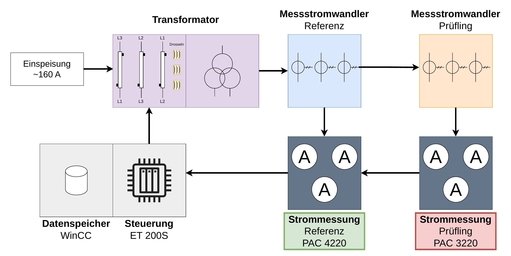
---

## Folie 10 Exemplarisches Messergebnis FFP

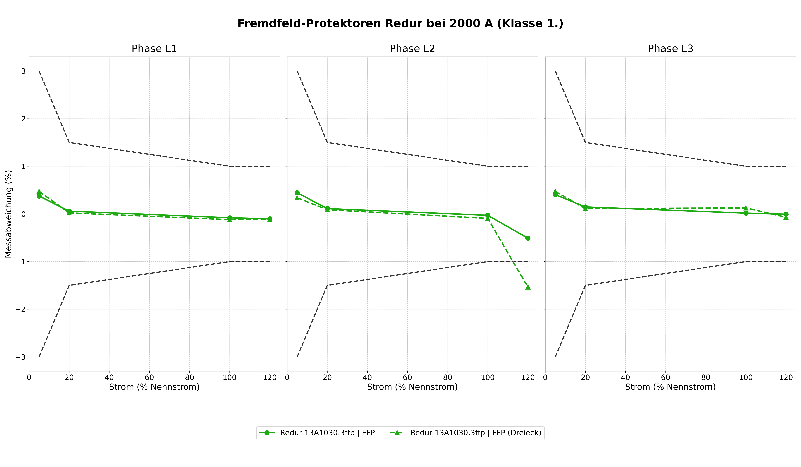

Hier zeige ich ein Beispiel für die Fremdfeldprotektion.

Man sieht, dass die Abweichungen im relevanten Bereich deutlich reduziert werden können. Gleichzeitig bleibt L2 der Kanal, der am empfindlichsten reagiert. Genau das passt zur physikalischen Erklärung, weil L2 im Feldzentrum liegt.

Für Bestandsanlagen ist dieser Ansatz interessant, weil man ohne großen Umbau der Leiterführung eine deutliche Verbesserung erreichen kann. In der Praxis ist aber wichtig, dass die Protektion korrekt positioniert ist und dass die Montage reproduzierbar ist. Sonst kann die Wirkung von Anlage zu Anlage schwanken.

---

## Folie 11 Standard im Dreieck gegen kompensiert

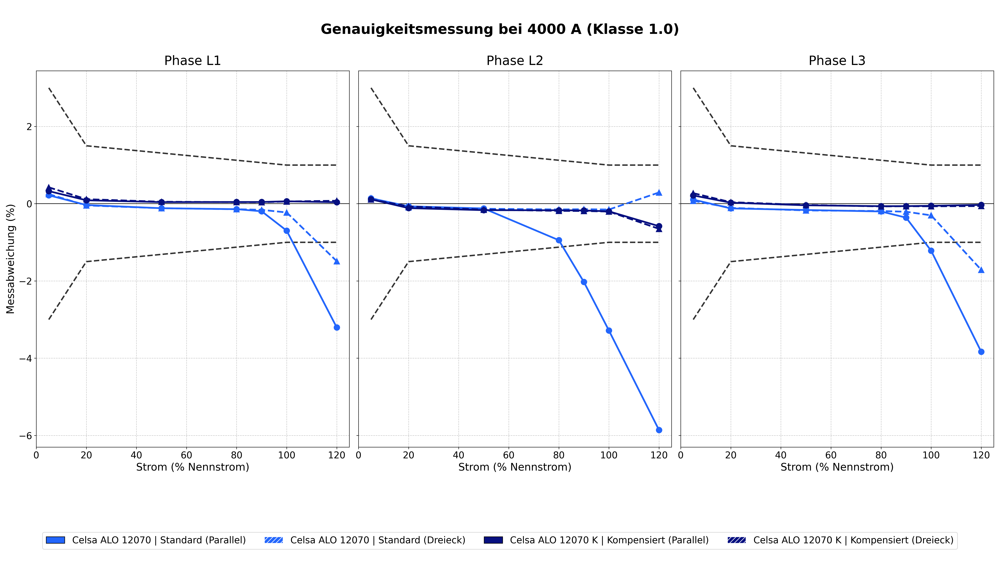

Jetzt kommt der Kernvergleich, weil er direkt zur Empfehlung führt.

Die kompensierte Variante bleibt über einen großen Bereich sehr nahe an der idealen Übersetzung. Das heißt, sie ist technisch robust, auch wenn die Last steigt oder wenn die Umgebung magnetisch ungünstig ist. Diese Lösung ist daher besonders geeignet, wenn maximale Genauigkeit gefordert ist oder wenn man einen breiten Betriebsbereich absichern muss.

Die Dreiecksanordnung mit Standardwandlern zeigt aber ebenfalls einen starken Effekt. Der entscheidende Vorteil ist, dass man die Messgüte über Geometrie stabilisiert, ohne den Wandler selbst zu einem Spezialteil zu machen. Das ist genau die Art Lösung, die in einer Neukonstruktion sehr attraktiv ist, weil sie Kosten und Risiko reduziert und gleichzeitig die Messung verbessert.

---

## Folie 12 Bewertung der Lösungsansätze

Ich fasse die Bewertung als Entscheidung nach Einsatzfall zusammen.

Wenn höchste Genauigkeit im Vordergrund steht, sind kompensierte Wandler die technisch beste Wahl. Sie liefern die stabilsten Kennlinien. Der Nachteil ist der Preis, der in der Praxis oft deutlich höher liegt als bei Standardwandlern.

Wenn eine Nachrüstung im Bestand gefragt ist, ist FFP häufig die pragmatischste Lösung. Sie kann starke Verbesserungen bringen, ohne dass die gesamte Leiterführung neu konstruiert werden muss. Wichtig ist eine robuste Montage, damit die Wirkung konstant bleibt.

Wenn es um neue Felder geht, ist die Dreiecksanordnung mit Standardwandlern der Preis Leistungs Sieger. Sie erreicht die Messgüte über eine systemische Maßnahme. Dadurch bleiben Standardkomponenten nutzbar und die Konstruktion kann trotzdem normnah messen, besonders im Nennlastbereich.

Der gemeinsame Nenner ist, dass alle drei Ansätze die L2 Verzerrung reduzieren. Die Unterschiede liegen in Kosten, Bauraum und Integrationsaufwand.

---

## Folie 13 Customer Win Standardwandler plus Dreieck

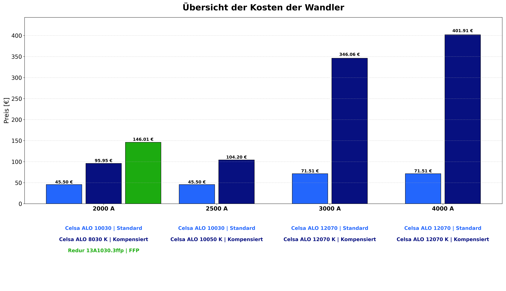

Diese Folie übersetzt die technische Empfehlung in Nutzenargumente.

Wenn Standardwandler beibehalten werden können und die Leiterführung in Dreieck ausgeführt wird, gibt es zwei Effekte. Erstens sinken die Stückkosten, weil man keine Spezialwandler benötigt. In der Folie ist dafür eine Größenordnung von rund 1000 Euro pro dreiphasigem Feld angegeben.

Zweitens verbessert sich die Messgüte im Nennbereich deutlich, obwohl Fremdfelder vorhanden sind. Das ist besonders relevant, weil viele Anlagen den Großteil ihrer Betriebszeit genau in diesem Bereich verbringen, also grob zwischen 80 und 100 Prozent Last.

Damit wird die Lösung interessant für Serienkonstruktionen, weil sie Kosten senkt und Messqualität gleichzeitig verbessert.

---

## Folie 14 Abschluss

Ich fasse die Kernaussagen in vier Sätzen zusammen.

Erstens können magnetische Fremdfelder in kompakten Niederspannungsschaltanlagen zu systematischen Messfehlern führen, besonders in L2.  
Zweitens lässt sich der Effekt durch kompensierte Wandler technisch sehr gut beherrschen, allerdings zu höheren Kosten.  
Drittens ist FFP eine starke Option für Bestandsanlagen, wenn Bauraum und Montage reproduzierbar sind.  
Viertens ist die Dreiecksanordnung mit Standardwandlern die bevorzugte Empfehlung für neue Konstruktionen, weil sie einen sehr guten Kompromiss aus Messgüte und Wirtschaftlichkeit bietet.

Vielen Dank für Ihre Aufmerksamkeit. Ich stehe jetzt gern für Fragen zur Verfügung.

---

# Anhang für die Fragerunde

## Überblick über mehrere Stromniveaus

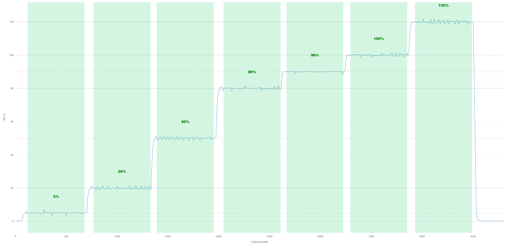

## Kennlinien für einzelne Stromstufen

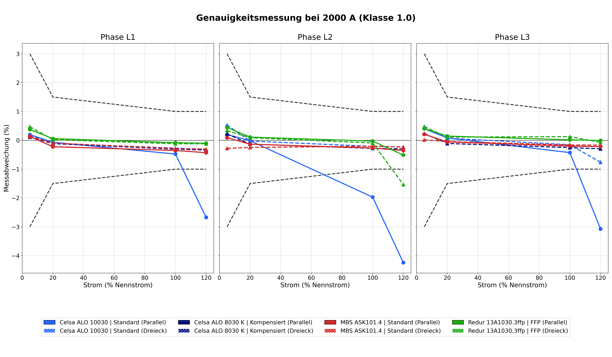  
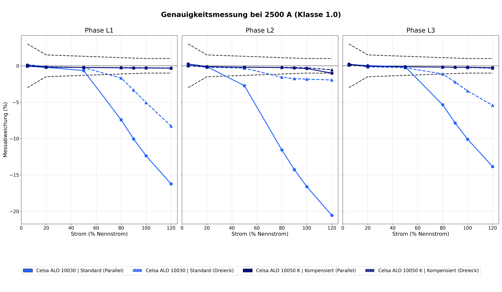  
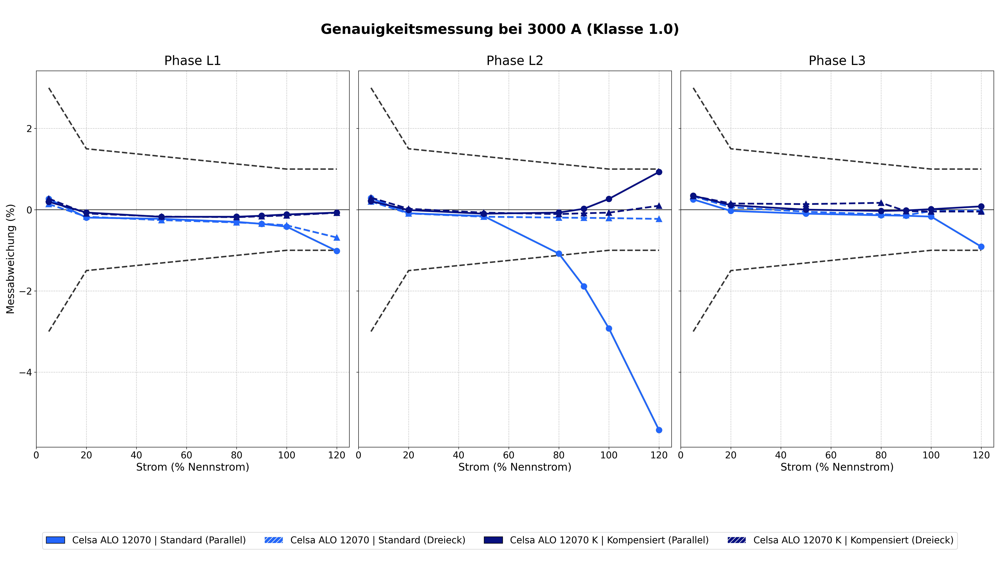  

